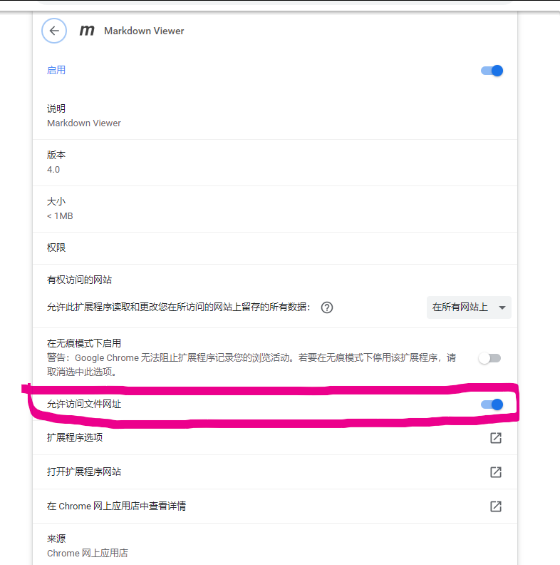

# 安装软件

sublimetext （编写markdown文档）

sublimemerge（用来同步git）

# 插件

## sublimetext插件imagepaste

可以直接复制粘贴图片到sublimetext中

ctrl + shift + P 调出命令行窗口
输入install pakage，点击

搜索插件imagepaste（我这里已经安装过，就搜索不到了）

安装后就可直接复制图片后在sublimetext中粘贴，默认会以文件名在当前目录创建文件夹来存储图片。

## chrome插件markdownviewer

用来查看md文件效果，在未上传到github时。

下载插件

配置

进入网址chrome://extensions/

开启允许文件网址

然后拖入md到chrome即可查看md文件渲染后的效果了。