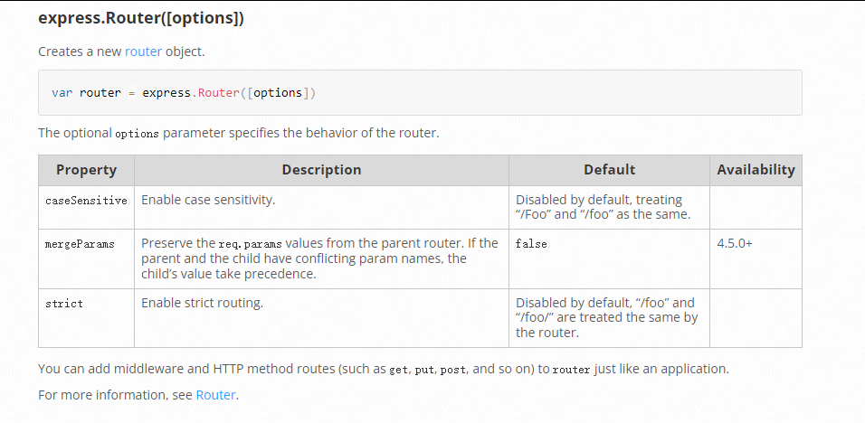
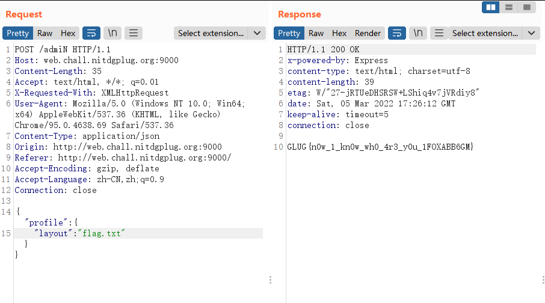

## Solution

### 绕过HAProxy ACL
HAProxy是一个使用C语言编写的自由及开放源代码软件，其提供高可用性、负载均衡，以及基于TCP和HTTP的应用程序代理。

查看[HAProxy配置文件](chall/haproxy.cfg)
```
frontend http-in
    bind *:80
    default_backend servers
    http-request deny if { path_beg /admin }
```
这一部分过滤掉了以/admin路径开头的请求。

我们想要进入[路由配置](chall/routes/main.js)
```
router.post('/admin', function(req, res, next) {
	var profile = req.body.profile
 	res.render('index', profile)
});
```
查看[express.Router文档](https://expressjs.com/zh-cn/api.html#express.router)



默认是对大小写不敏感。

我们可以使用/admiN方式绕过HAProxy的限制。

### 在Handlebars使用layout参数读取文件

没有找到官方文档的信息。
在[stackoverflow](https://stackoverflow.com/questions/26871522/how-to-change-default-layout-in-express-using-handlebars)找到一段信息


There are two ways to set a default layout: configuring the view engine's defaultLayout property, or setting Express locals app.locals.layout.

The layout into which a view should be rendered can be overridden per-request by assigning a different value to the layout request local. The following will render the "home" view with no layout:
```
app.get('/', function (req, res, next) {
   res.render('home', {layout: false});
});
```

我们利用传入layout参数来覆盖原有的模板。

模板路径在[main.js](chall/app.js)设置如下
```
app.set('views', path.join(__dirname, 'views'));
```
因为flag.txt在views目录下

可以直接读取flag.txt文件。

最终payload如下
